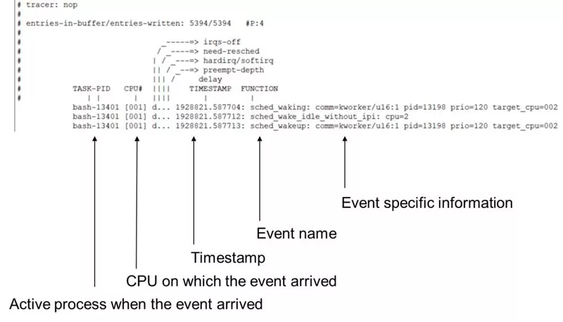
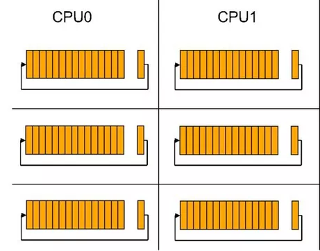
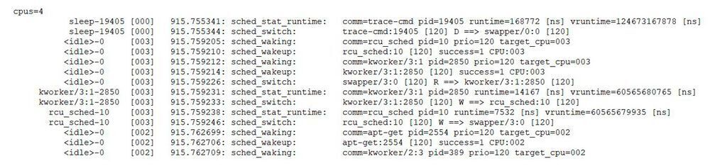

# Einleitung

Tracing ist die spezielle Verwendung der Protokollierung zur Aufzeichnung von Informationen über den Ausführungsablauf eines Programms.
Oft werden mit eigenständig hinzugefügte Print-Messages der Code debuggt. Somit verfolgt man die Anweisungen mit einem eigenem tracing-System.
Linux bringt einige eigenständige Tools mit, mit denen es möglich ist Vorgänge innerhalb von einem Embedded-System nachvollziehen und analysieren zu können.
Die Linux-Tracing Funktionalität und die bestehenden Tools, welche im Linux-Kernel integriert sind, helfen so dabei bei der Identifikation von Laufzeiten, Nebenläufigkeiten  und der Untersuchung von Latenzproblemen.

## Relevanz

Bei Mikrokontrollern und meist in Zusammenhang mit Realtime OS ist jede Aktion die Ausgeführt wird von hoher Bedeutung. Moderne Linux Systeme sind sehr komplex und bestehen aus vielen Softwaremodulen, welche auf unterschiedlichesten Weißen untereinander interagieren. Um zu verstehen warum gewisse Aktionen ausgeführt werden, ist es wichtig Systemnah debuggen und diese analysieren zu können. Oft können Fehler repoduziert und mit solchen Anaylsen identifiziert werden. Zusätzlich besteht bei Custom Driver die Möglichkeit während des bootvorgangs zu debuggen. 

# Grundlagen

## Ringbuffer

Bei einem Ringbuffer handelt sich um eine Datenstruktur, die es `reader` und `writer` erleichtert, Informationen asynchron auszutauschen. Der Puffer wird in der Regel als Array mit zwei Zeigern implementiert. Einem Lesezeiger und einem Schreibzeiger. Man liest aus dem Puffer, indem man den Inhalt des Lesezeigers liest und dann den Zeiger auf das nächste Element erhöht, und ebenso beim Schreiben in den Puffer mit dem Schreibzeiger.

## Debug-Filesystem

* möglichkeiten

```bash
#ENABLE DEBUG FS
$ sudo mount -t debugfs debugfs /sys/kernel/debug
```

## Tracing


Durch das Debug-Filesystem ist jetzt der Zugriff auf die Debug und insbesondere auf die Tracing-Daten möglich.
Im Debug-Filesystem ist nach aktivierung der `tracing`-Ordner vorhanden.
In diesem werden die verfügbaren Events in Gruppen (Ordnern) dargestellt, auf welche im späteren Verlauf reagiert werden können. Zudem können hier auch die Verfügbaren `tracer` angezeigt und aktiviert werden, welche noch mehr debugging Optionen bereitstellen.


### Tracer

```bash
# GET TRACERS
$ cat /sys/kernel/debug/tracing/available_tracers
hwlat blk mmiotrace function_graph wakeup_dl wakeup_rt wakeup function nop
# USE SPECIFIC TRACER
$ echo function_graph > /sys/kernel/debug/tracing/current_tracer
# DISABLE TRACER USAGE
$ echo nop > /sys/kernel/debug/tracing/current_tracer
```

`tracer` sind zusätzliche Tracing-Tools, welche eine gezieltere Aggregierung von Events z.B. Filterung und somit tiefergehende Analyse erlauben.
Zum Beispiel erlaubt der `ftrace`-Tracer eine detaillierte Ereignis-Filterung auf spezifizierte Events[@ftraceintroducation].
Der `function_graph`-Tracer gibt bei Verwendung zusätzliche Informationen, wie z.B. die Laufzeit von einzelnen Funktionen[@fgtrace].
Auch kann dieser den Stacktrace und den Call-Stack übersichtlich darstellen, indem hier die Namen der aufgerufenen Funktionen ausgegeben werden. 

```bash
# CALL STACK USING FUNCTION_GRAPH TRACER
$ echo function_graph > /sys/kernel/debug/tracing/current_tracer
$ cat /sys/kernel/debug/tracing/trace
# tracer: function_graph
# CPU-  DURATION          FUNCTION CALLS
# |     |   |            |  |   |
 0)               |      getname() {
 0)   4.442 us    |         kmem_cache_alloc() {
 0)   1.382 us    |             __might_sleep();
 0)   2.478 us    |        }
 [...]
```

### Events

In der `ls`-Ausgabe des `events`-Ordners des Debug-Filesystems ist zu sehen, welche Events abgefangen und mittels der Linux-Tracing-Tools protokoliert werden können.

```bash
# GET AVAILABLE EVENT LIST
$ cd /sys/kernel/debug/tracing/events
$ ls -lah | awk '{print $9}'
alarmtimer
clk
cpuhp
drm
exceptions
ext4
# =>  EXT4_READPAGE, EXT4_WRITEPAGE, EXT4_ERROR, EXT4_FREE_BLOCKS
filelock
filemap
fs_dax
ftrace
gpio
# => GPIO_DIRECTION, GPIO_VALUE
hda
i2c
irq
net
smbus
# => READ, WRITE, REPLY
sock
# => SOCKET_STATE_CHANGED, SOCK_EXCEED_BUFFER_LIMIT, SOCK_REC_QUEUE_FULL
spi
tcp
timer
# => TIMER_STOP, TIMER_INIT, TIMER_EXPIRED
[...]
```

Alle Events sind in Gruppen gebündelt. Alle Events, welche das `ext4`-Filesystem betreffen, befinden sich im `ext4`-Ordner.
Die Auflistung zeigt einige der für das `ext4` zur Verfügung stehenden Events.
Zudem befinden sich zwei zusätzliche Dateien `enable`, `filter `in diesem Ordner.
Durch diese ist es später möglich anzugeben, ob dieses Event aufgezeichnet werden soll.

```bash
$ cd /sys/kernel/debug/tracing/events/ext4
$ ls -lah | awk '{print $9}'

# EVENTS FOR EXT4
ext4_write_end
ext4_writepage
ext4_readpage
ext4_error
[...]
# INTERFACE FOR EVENT SETUP
enable
filter
format
```

Die optionale `format`-Datei kann zusätzliche Informationen bereitstellen über das, durch das Event bereitgestellt Format der Ausgabe.
Das folgende Beispiel zeigt das Ausgabeformat für das Scheduler-Wakeup `sched_wakeup`-Event.
Somit kann nicht nur in Erfahrung gebracht werden, wann und ob das Event ausgelößt hat, sondern es können auch weitere Event-Spezifische Informationen durch das Event gemeldet werden. 

```bash
$  cat /sys/kernel/debug/tracing/events/sched/sched_wakeup/format
ID: 318
format:
	field:unsigned short common_type;	offset:0;	size:2;	signed:0;
	field:unsigned char common_flags;	offset:2;	size:1;	signed:0;
	field:unsigned char common_preempt_count;	offset:3;	size:1;	signed:0;
	field:int common_pid;	offset:4;	size:4;	signed:1;

	field:char comm[16];	offset:8;	size:16;	signed:1;
	field:pid_t pid;	offset:24;	size:4;	signed:1;
	field:int prio;	offset:28;	size:4;	signed:1;
	field:int success;	offset:32;	size:4;	signed:1;
	field:int target_cpu;	offset:36;	size:4;	signed:1;
```


## Abfangen von Events

Um ein `event`[@events] abfangen zu können, muss dies zuerst für die gewünschten Events aktiviert werden.
Hierzu werden die Event-Interface-Dateien verwendet, welche sich in jeder Event-Gruppe befinden.
Die einfachste Methode ist es, eine `1` oder `0` in die `enable`-Datei der Gruppe zu schreiben.
Ein spezifisches Event kann mit der gleiche Methode aktiviert werden. Hierzu wirde die `enable`-Datei im eigentlichen Event-Ordner verwendet anstatt jene, welche ich in de Event-Gruppe befindet.


```bash
$ cd /sys/kernel/debug/tracing/events/ext4
# ENABLE ALL EVENTS FROM THIS GROUP
$ echo 1 > ./enable
# DISBALE ALL EVENTS
$ echo 0 > ./enable
# ENBABLE SPECIFIC EVENT
$ echo 1 > ./ext4_readpage/enable
$ echo 1 > ./ext4_writepage/enable
```

Nach dem Aktivieren der Events, können 


## Probes

* was sind probes
### kprobes

`kprobes`[@kprobes] können dazu verwendet werden, Laufzeit und Performance-Daten des Kernels zu sammeln.
Der Vorteil and diesen ist, dass diese Daten ohne Unterbrechnung der Ausführung auf CPU-Instruktions-Ebene aggregiert werden können, anders wie bei dem Debuggen eines Programms mittels Breakpoints.
Ein weiterer Vorteil ist, dass das Registrieren der Kprobes dynamisch zur Laufzeit und ohne Änderungen des Programmcodes geschieht.
Somit ist es möglich zu verschiedenen Laufzeiten des zu analysierenden Systems oder Programms, Daten zu verschiedenen Laufzeiten gezielt sammen zu können.

Der `kretprobes`[@kretprobes] ermöglicht uns auf den Rückgabewert jeder Kernel- oder Modulfunktion zuzugreifen! Die Möglichkeit, den Rückgabewert einer bestimmten Funktion dynamisch nachzuschlagen, kann in einem Debug-Szenario ein entscheidender Vorteil sein.

### uprobes

Eine Weiterentwicklung zu den kprobes sind die uprobes. Mit diesem können zur Laufzeit Events in eine Applikation eingebunden werden. 
Wenn ein uprobes hinzugefügt werden soll, muss davor noch was gemacht werden. Bei der Nutzung von kprobes kann ein einfacher Symbolnamen spezifiziert werden. Aufgrund das alle Applikationen ihren eigenen virtuellen Adressraum besitzen, haben diese auch einen anderen Adressbasis. Beim Erzeugen eines uprobes wird das Adressoffset im Textsegment der jeweiligen Applikation benötigt.

```c++
// hello.c
#include <stdio.h>

int main(void)
{
    int i;

    for (i = 0; i < 5; i++)
        printf("Hello uprobe\n");

    return 0;
}
```

```bash
# CREATE EXECUTE OBJECT
$ /root/gcc hello.c -o hello
# GET OFFSET
$ objdump -F -S -D hello | less
# CREATE A uprobe_event
$ echo "p:my_uprobe /path_to_application/hello:<0xOffset>" > uprobe_events
# ACTIVATE UPROBE EVENTS
$ echo 1 > /sys/kernel/tracing/events/uprobes/my_uprobe/enable
# EXECUTE
$ /root/hello
Hello uprobe
[...]
# PRINT TRACED EVENTS
$ cat /sys/kernel/debug/tracing/trace
```

* für anwendungn
* system libs


## Nachteile / verscfälschung

Beim tracing werden zusätzliche ressourcen benötigt, die Auswirkungen auf die reale Ausführzeit haben. Bei Realtime OS können diese problemeatisch werden, wenn diese bereits mit dem maximalen ressourcen arbeitet.

* welche effekte können entstehen
* tracing bracuth ressoucen
* last minimieren auf traget minimieren
* nur aufzeichnen und später analysieren z.B. auf einem anderen system
* wie verhindern


# Tools

Allgemein sind keine speziellen Programme notwending um die Laufzeiteigenschaften eines Programms aufzuzeichnen.
Der Linux-Kernel bringt bereits alle nötigen Funktionalitäten mit. Jedoch gibt es Tools die eine visuelle Darstellung der aufgezeichneten Events ermöglichen.


## Trace-Log Aufzeichnung

Für die Log-Aufzeichnung wird ein Ringbuffer genutzt. Das Aufzeichnen in den Ringpuffer ist Standardmäßig aktiviert. 

```bash
# Disable the Recording on the ringbuffer
$ echo 0 > tracing on
```

Mit dem folgenden Befehl kann der Inhalt des Ringuffers, auch während einer Aufzeichung, ausgebeben werden:

```bash
$ less trace
```
Das Lesen während einer Aufzeichnung mit trace hat keinerlei Einfluss auf den Inhalt des Ringpuffers. Die Ausgabe des letzten Kommandos wird dabei in einem menschenlesbaren Format dargestellt \ref{trace-log}:



Die bisheirgen Aufzeichnungen der Ereignisse können mit einem einfachen Befehl entfernt werden:

```bash
$ echo > trace
```
Um einen Überlauf an Informationen zu verhinden kann die Aufzeichnung auch konsumierend gelesen werden. Somit werden beim Lesen zeitgleich diese aus dem Ringbuffer entfernt \ref{ringbuffer}.

Eine weitere Kernpunkt ist, dass in Mehrkernsystemen für jeden einzelnen Core ein separater Ringbuffer existiert. Damit die Analyse von verschiedenen Events getrennt werden kann, kann mit jeder weiteren Instanz pro Core ein weiterer Ringbuffer angelgt werden. Dies erfolgt im Untervereziechnis `instances/`.

```bash
$ cd instances
$ mkdir inst0
$ mkdir inst1

# Remove if the instances is not needed anymore
# rmdir inst0
```



### trace-cmd

Das Tool `trace-cmd`[@trace-cmd] ist das bekannteste und am meisten genutzte Hilfmittel zur Aufzeichnung. Dies ist ein kommandozeilenwerkzeug, das auf den meisten gängingen Linux Distrubitionen bereits vorinstalliert ist.

```bash
# CHECK IF TRACING IS ENABLED
$ sudo mount | grep tracefs
none on /sys/kernel/tracing type tracefs (rw,relatime,seclabel)
## ONLY SCHEDULER EVENTS
$ echo sched_wakeup >> /sys/kernel/debug/tracing/set_event
## ALL EVENTS USING set_event
$ echo *:* > /sys/kernel/debug/tracing/set_event
# RECORD
$ trace-cmd record ./program_executable
# RECORD SPECIFIC EVENT
$ trace-cmd record -e sched ./program_executable
# USING A ADDITIONAL TRACER
$ trace-cmd -t function ./program_executable
```

* output erklörung

Mit dem letzten Befehl werden die ganzen Events zu Scheduler aufgezeichnet. Dabei werden während der Aufzeichnung kontinuierlich die Ringbuffer in konsumierender Form ausgelesen und in die Datei `trace.dat` geschrieben, falls mit dem `-o` keine eigene Datei eingegeben wurde. Als Informationen werden zu dem Inhalt des Ringbuffers auch zusätzlich notwendige Informationen über das Target, für die Auswertung auf beliebigen System gespeichert.

Die `trace-cmd` Konsolenanwendung dient nicht nur zur Aufzeichnung der Trace-Events, sondern bietet auch die Möglichkeit augezeichnetet Reports visuell darzustellen.
Die Ausgabe erfolgt mit dem Befehl `trace-cmd report [-i <Dateiname>]` als Tabelle in der Konsole und ist somit rein Textbasiert\ref{trace-cmd-report}.



Auf diese Aufzeichnung zusätzlich ein Filter angewendet werden, um die Suche auf bestimten Erreignissen einzugrenzen.

Mit dem Tool ist es einfach die Teilschritte zu automatisieren.

### bpftrace

Seit der Kernelversion `>4.x`, kann ein weiteres Tool mit dem Namen `bpftrace`[@bpftrace] verwendet werden.
Dieses bietet jedoch zusätzlich eine eigene Skripsprache mit der nicht nur Aggreation, sondern auch die Eventfilter und die Verarbeitung der Ergebnisse automatisiert werden können.

```bash
# Block I/O latency as a histogram EXAMPLE
$ wget https://raw.githubusercontent.com/iovisor/bpftrace/master/tools/biolatency.bt
$ bftrace ./biolatency.bt
@usecs:
[512, 1K)             10 |@                       |
[ 1K, 2K)            426 |@@@@@@@@@@@@@@@@@@      |
[2K, 4K)             230 |@@@@@@@@@@@@@@          |
[4K, 8K)               9 |@                       |
[8K, 16K)            128 |@@@@@@@@@@@@@@@         |
[16K, 32K)            68 |@@@@@@@@                |
[...]
```


### Kernelshark

Das zuvor vorgestellte `tace-cmd` ist wie oben erwähnt nur ein textbasiertes Analysetool.
Kernelshark Tool bietet dem Anwender die Möglichkeit die Traceaufzeichnungen grafisch zu analysieren. Dabei sind die beiden Tools aufeinander abgestimmt und werden gemeinsam entwickelt.
Auch dieses Tool ist in den meisten Linux Distributionen vorinstalliert.

Das vom trace-cmd erzeugte `trace.dat-Format` wird im Kernelshark als Eingabe erwartet. Wenn im folgendem ersten Befehl nichts eingegeben, dann wird nach der entsprechenden `trace.dat` im Verzeichnis gesucht.

```bash
# OPEN KERNELSHARK WITH trace.dat
$ kernelshark
# OPEN KERNELSHAR WITH SPECIFIED TRACELOG
$ kernelshark -i <Dateiname>
```

Im folgenden ist die grafische Darstellung zu sehen. Dabei besitzt jeder Task ein eigenen Farbton. Für jede CPU wird eine eigene Zeile dargestellt. Dieses Tool hat eine gewisse Ähnlichkeit mit der von uns genutzten Logic 2 Software.


# Beispiel - TCP Paketanalyse

Dieses Beispiel soll zeigen, wie der Empfang von TCP-Netzwerkpaketen auf Paketverlust auf einem System überprüft werden kann.
Hierbei soll analysiert werden, wie das System auf eine unerwartet große Menge an TCP-Paketen reagiert.

## Ausgangsszenario

* iot anwendungen
* viele kleine pakete

## bpftrace Installation
Hierbei wird auf dem zu analysierenden System `bpftrace`[@bpftrace] verwendet. Unter Debian-Systemen kann dies einfach über den APT-Package-Manager installiert werden. Jedoch ist diese Version welche in der Registry hinterlegt ist meist nicht aktuell.
Das folgende Beispiel erfodert die Version `>= 0.14`.
Somit muss `bpftrace` aus den Quellen gebaut werden, da in der APT-Registry nur die Version `~0.11` zur Verfügung stand.

```bash
# INSTALL FROM SOURCE
$ git clone https://github.com/iovisor/bpftrace ./bpftrace
$ cd ./bpftrace && mkdir -p build
$ cmake -DCMAKE_BUILD_TYPE=Release . && make -j20
$ sudo make install
# GET TCP DROP EXAMPLE
$ cp ./bpftrace/tools/tcpdrop.bt ~
```

## TCPDROP.BT

Das `tcpdrop.bt` Script, welches in diesem Beispiel verwendet wird, registriert eine `kprobe` auf die `tcp_drop()` Funktion und 
nutzt anschließend `printf` Funktion um die Informationen in den Userspace zu loggen.

```c++
// tcpdrop.bt - SIMPLIFIED
kprobe:tcp_drop
{
    // GET SOCKET INFORMATION
    $sk = ((struct sock *) arg0);
    $inet_family = $sk->__sk_common.skc_family;
    //ADRESSES
    $daddr = ntop($sk->__sk_common.skc_daddr);
    $saddr = ntop($sk->__sk_common.skc_rcv_saddr);
    // PORTS
    $dport = $sk->__sk_common.skc_dport;
    $dport = $sk->__sk_common.skc_dport;
    //LOG INTO USERSPACE
    printf("%39s:%-6d %39s:%-6d %-10s\n", $saddr, $lport, $daddr, $dport, $statestr);
}
```

Um eine Lastspitze auf dem System zu erzeugen wurde das Netzwerkbenchmark-Tool `ntttcp`[@ntttcp] verwendet. Mit diesem ist es möglich UDP und TCP Pakete mit verschiedenen Paketgrößen zu generieren.
Hierzu werden zwei Instanzen benötigt, der Server und der Client, welche auf dem gleichen System aber auch auf verschiedenen Systemen ausgeführt werden können.

## Aufzeichnung Trace-Log

Um die Messung zu starten, wurde zuerst der `ntttcp`-Server gestartet, dieser empfängt die vom Sender gesendeten Pakete.
Im zweiten Schritt wurde der `ntttcp`-Client auf dem anderen System gestartet. Hier wurde mittels `-t` Parameter die Laufzeit auf unendlich gestellt, somit werden durchgehend Pakete an den Server gesendet. Die Paketgröße wurde hier auf `4096Kbyte` gestellt um so eine Fragmentierung des TCP-Paketes bei einer MTU von `1500byte` zu erzwingen.

Im Anschluss wurde `bpftrace` gestartet, welches die Events als Logdatei `tcpdrop_log` in einem lesabren Textformat ausgeben soll.

```bash
# START SERVER
$ ntttcp -r
NTTTCP for Linux 1.4.0
---------------------------------------------------------
21:27:58 INFO: 17 threads created


# RUN bpftrace RECORD
$ sudo bpftrace -o ~/tcpdrop_log -f text -v ~/tcpdrop.bt 
INFO: node count: 171
Program ID: 146
The verifier log: 
processed 374 insns (limit 1000000) max_states_per_insn 0
Attaching BEGIN
[...]

# START CLIENT # PACKET SIZE 16Byte
$ ntttcp -s10.11.12.1 -t -l 16
NTTTCP for Linux 1.4.0
---------------------------------------------------------
21:28:52 INFO: running test in continuous mode.
21:28:52 INFO: 64 threads created
21:28:52 INFO: 64 connections created in 5656 microseconds
21:28:52 INFO: Network activity progressing...
```

Nach einigen Sekunden wurde `ntttcp` und `bpftrace` die Aufzeichnung manuell gestoppt.
Der aufgezeichnete Trace für das `tcp_drop`-Event befindet sich in der `tcpdrop_log` Datei.

## Ausgabe

Die Ausgabe der Logdatei stellt Textbasiert nicht nur dar ob ein TCP-Paket verloren wurde, sondern gibt auch zusätzliche Informationen aus. Jeder Event-Trigger des `tcp_drop()` Events wird dabei mit der Systemzeit, Prozess-ID und dem Programm eingeleitet unter welches das Event ausgelößt hat. In diesem Fall wurde der Paketverlust durch ein Empfangenes Paket der `ntttcp`-Anwendung ausgelößt.
Die Senderichtung des Pakets kann anhand der Quell- und Empfangs-IP-Adresse ermittelt werden.
Danach folgt der Kernel-Stacktrace, in welchem der Funktionsaufruf-Verlauf bis zum Auslösen des überwachten Event aufgeführt ist.

```bash
$ cat ~/tcpdrop_log
[..]
# tcp_drop() TIME   PID  APPLICATION    SOURCE  DESTINATION
21:36:57 18157 ntttcp 10.11.12.1:5014 10.11.12.2:59012
        #CALLSTACK
        # LAST FUNCTION CALL
        tcp_drop+1
        tcp_v4_do_rcv+196
        __release_sock+120
        __tcp_close+444
        tcp_close+37
        inet_release+72
        __sock_release+66
        sock_close+21
        __fput+156
        ____fput+14
        task_work_run+112
        exit_to_user_mode_prepare+437
        syscall_exit_to_user_mode+39
        do_syscall_64+110
        entry_SYSCALL_64_after_hwframe+68
        # FIRST FUNCTION CALL
[...]
```

Somit ist aus den Logs zu entnehmen, dass unter den getesteten Bedingungen auf dem System TCP Pakete verloren gingen, eine tiefergehende Untersuchung des Kernel-Stacktrace kann hierzu genauere Informationen bereitstellen.
Das Beispiel zeigt auch, wie nicht nur das Auslösen von Events protokolliert werden kann, sondern auch mittels einfacher Script-Befehle komplexe Debug-Informationen systematisch gewonnen werden können.


# Beispiel - Identifikation von Laufzeitproblemen

In diesem Abschnitt soll an einem einfache Beispiel gezeigt werden, wie es mittels Tracing möglich ist, eine Laufzeitanalyse auf verschiedenen Systemen für eine Anwendung durchzuführen.


## Ausgangsszenario

Als Ausgangspunkt dieses Beispiels, soll das Laufzeitverhalten eines Programms auf einem Linux-System analysiert werden.
Die zugrunde liegende Software wurde bisher nur auf einem Linux-Realtime Kernel verwendet,
jedoch erfordert die Implementation neuer Features eine neuere Kernel-Version, welche noch nicht als RT-Version auf dem System zur Verfügung steht.
Somit soll ermittelt werden, ob die unmodifizierte Software eins zu eins auf dem neuen System lauffähig ist und die Laufzeitandorderungen erfüllt.

Das System besteht hier aus einem `RaspberryPi 4B` mit einer angeschlossenen LED am GPIO-Port `24`
und zu testende Programm toggelt dabei den GPIO in einer Dauerschleife.

```c++
//gpio_test.cpp
#include <iostream>
#include <pigpio.h>
#include <csignal>
using namespace std;

volatile bool running = true;
const int GPIO = 24;
void signal_callback_handler(int signum) {
    running = false;
}

int main(int argc, char *argv[])
{
    //REGISTER SIGNAL HANDLER
    signal(SIGINT, signal_callback_handler);
  
    if (gpioInitialise() < 0){
        return -1;
    }
    gpioSetMode(GPIO, PI_OUTPUT);
    bool state = false;
    while(running){
        state = !state;
	    gpioWrite(GPIO, (int)state);
    }
	return 0;
}
```

Das Programm kann mittels `g++` Compiler für das Zielsystem übersetzt werden.
Da zur Ansteuerung des GPIO Ports die `pigpio` Bibliothek verwendet wurde, welche eine Alternative zur obsoltenen `WiringPi` Bibliothek darstellt, muss diese noch installiert werden.

```bash
# INSTALL PIGPIO LIB
$ git clone https://github.com/joan2937/pigpio.git ~/pigpio
$ cd ~/pigpio && make && sudo make install && cd ~
# COMPILE
$ g++ -Wall -pthread -o gpio_test gpio_test.cpp -lpigpio -lrt
# TEST
$ sudo ./gpio_test
```


## Kernel des Testsystems


Für den Test wurde als RT Kernel die Version `4.19.59-rt23-v7l+` verwendet, welche nicht alle Funktionaltitäten des aktuellen `5.10` Kernel besitzt.
In diesem fiktiven Beispiel, wird die `systemd-networking >V.248` Funktionalität für das Batman-Protokoll benötigt, welche den Grund für die Umstellung darstellt und nicht trivial in den `4.x` Kernel integriert werden kann. Die Messungen wurden zuerst auf dem aktuellen `5.10 LTS` Kernel aufgezeichnet und im Anschluss wurde der RT-Kernel auf einem anderen System per Cross-Compilation[@rpi4rt] aus dem `rpi-4.19.y-rt` Branch des `raspberrypi/linux` Repository gebaut. Dieser Schritt war notwendig, da es kein fertiges RT-Kernel Image zur Verfügung stand.
Die erzeugten Dateien wurden dann auf die Boot-Partition der SD Karte geschrieben und in der `/boot/config.txt` Datei wurde der neue Kernel installiert `kernel=kernel7_rt.img`.


## Aufzeichnung Trace-Log

Zur Aufzeichnung des Trace-Logs wurde `trace-cmd`[@trace-cmd] verwendet. Auf dem Zielsystem wurde dabei nur die Aufzeichnung vorgenommen und die Analyse der Logs erfolgte auf einem seperaten System.
Für den Test wird zuerst die `tracing`-Funktionalität aktiviert und alle `sched` und `gpio`-Events aktiviert.

```bash
# ENABLE TRACING
$ echo 1 > /sys/kernel/debug/tracing/tracing_on
$ cat /sys/kernel/debug/tracing/trace
# CLEAR RECENT EVENT LOG
$ echo > /sys/kernel/debug/tracing/trace
# ENABLE ALL SCHEDULER EVENTS
echo 1 > /sys/kernel/debug/tracing/events/sched/enable
# ENABLE ALL GPIO EVENTS
echo 1 > /sys/kernel/debug/tracing/events/gpio/enable
# RUN TEST
sudo trace-cmd record -e sched -e gpio -o ./gpio_test_trace_lts ./gpio_test
```

Im Anschluss wurde das Programm gestartet und die Events mittels `trace-cmd` aufgezeichnet.
Da das Testprogramm nicht automatisch terminiert (wie z.B. `sleep 5`), muss dieses mittels `Ctl+C` manuell beendet werden.
Die resultierende Ausgabedatei `gpio_test_trace_*` enthält die von `trace-cmd` geloggten Daten.


## Visualisierung und Beurteilung des Trace-Logs

### RT Kernel

### LTS Kernel

## Fazit

* aufzeicnugn auf device => headless
* analyse visuell
