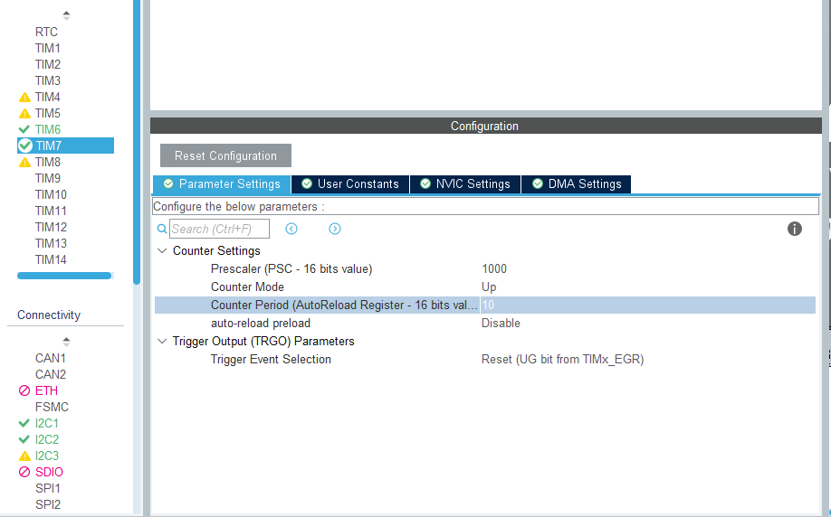
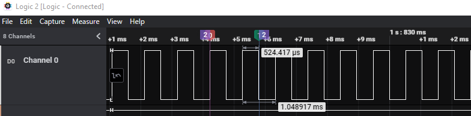
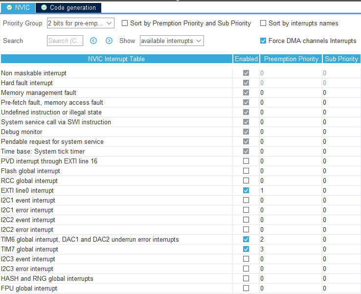
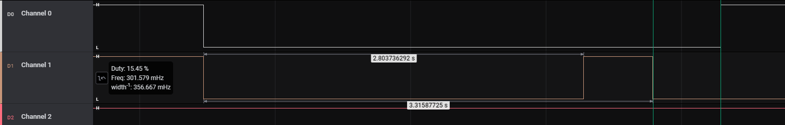

# PRAKTIKUM 1 - REAKTIONSSPIEL


## AUFBAU


```c++
// main.c 102
  	lcd_handle.i2c_handle = &hi2c1;
```
Das Display ist mit der ersten I2C Schnittstelle verbunden, somit muss dies an die folgenden GPIOs angeschlossen werden.

| DISPLAY | STM-DISCOVERY |
|---------|---------------|
| VCC     | 5V            |
| GND     | GND           |
| SCL     | PB6 (I2C1)    |
| SDA     | PB9 (I2C1)    |


Zusätzlich wurden weitere GPIOs für ein einfaches Abgreifen von Timer und Button-IRQ hinzugefüg.
Diese werden später für die Laufzeitmessungen verwendet.

| GPIO OUT FUNCTION | STM-DISCOVERY | LOGIC_ANALYSER_CHANNEL |
|-------------------|---------------|------------------------|
| TIMER_7_OUT       | PC1           | 1                      |
| TIMER_6_OUT       | PC2           | 2                      |
| LAUFZEITMESSUNG   | PC4           | 3                      |
| EXTI_0 IRQ        | PC5           | 4                      |


## LEDs

Um eine einfache Ansteuerung der LEDs zu ermöglichen, wurde diesen in den Projekteinstellungen `USER-Labels` zugewiesen.
Nach der Generierung des Codes, werden die Labels als zusätzliche Defines erstellt. 
Jeweils mit der Port und Pin-Definition
```c++
//main.cpp 275
    //GREEN LED
    HAL_GPIO_WritePin(GREEN_LED_GPIO_Port, GREEN_LED_Pin, ENorDI);
    //ORANGE LED
	HAL_GPIO_WritePin(ORANGE_LED_GPIO_Port, ORANGE_LED_Pin, ENorDI);
```

## TIMER 7 - MEASUREMENT TIMER

Der Timer7 wird in diesem Projekt, für das Messen der Zeit zwischen Spielstart `state=STATUS_RANDOM_TIMER_EXPIRED` und der Wechsel in den `state=STATUS_MEASUREMENT_DONE` Status.
Dieser wird mit den Betätigen des User-Buttons `PA0` gewechselt.
Der Timer soll eine Periodendauer von `1ms` haben, somit soll auch die Zeit in `ms` Schritten angezeigt werden.
Hierzu muss der Prescaler angepasst werden.



In der Clock-Configuration, wird der Timer7 über die `APB1 Timer-Clock` Einstellung eingestellt.
Diese ist in der Projektmapp auf `10.5 MHz` eingestellt. Mittels des Prescalers des Timers kann der Takt reduziert werden.
Hier `10.000.000 / 1000 ms/s * 10 counter_period = 1.000 PSC`, somit wird der Interrupt jede Milli-Sekunde ausgelößt.



Die Messung zeigt, dass mit diesen Einstellungen eine Periodendauer von `1.0489ms` erreicht wird, welches für diesen Anwendungsfall ausreichend ist.


## TIMER 6 - RANDOM TIMER

Der Timer6 wird verwendet um eine zufällige Wartezeit zwischen dem Start des Programms und dem Spielstart zu realisieren.
Hierzu wird zuerst eine Zufallszahl mittels `HAL_RNG_GenerateRandomNumber` erzeugt und anschließend auf den angegeben Wertebreich begrenzt.

```c++
//main.cpp 248
    	//GET RANDOM NUMBER
	uint32_t rng = 0;
	HAL_RNG_GenerateRandomNumber(&hrng, &rng);
	//MAP 0-65536 => MIN_RND_VALUE-MAX_RND_VALUE
	rng = ((uint16_t)rng) * (MAX_RND_VALUE - MIN_RND_VALUE) / 65536 + MIN_RND_VALUE;
```

Da hier der Timer6 eine variable warte Zeit haben soll, bevor der Interrrupt ausgelößt werden soll, muss hier die Periode zuer Laufzeit gesetzt werden.
Die kann zum einen durch einen direkten Registerzugriff erfolgen:

```c++
htim6.Instance->CNT = 0;
htim6.Instance->ARR  = rng;
```

oder durch ändern der Timer-Configuration und anschließender erneuter Initialisierung:

```c++
//main.cpp 266
    //BASIS SETUP: htim6.Init.AutoReloadPreload = TIM_AUTORELOAD_PRELOAD_ENABLE;
    HAL_TIM_Base_Start_IT(&htim6);
	htim6.Init.Period = rng;
    HAL_TIM_Base_Init(&htim6);
```

## NVIC




Durch die Verwendung der verschiedenen Timer und der `HAL_Delay` Funktion, muss das Interrupt-Verhalten zusätzlich angepasst werden.
Hierzu müssen die Prioritäten so angepasst werden, dass sich die durch die Timer und Sys-Tick ausgelößten Interrrupts in der richtigen Reihenfolge unterbrechen können. 
Somit wurden drei Gruppen erstellt:

* `0` => `SysTick`
* `1` = `EXTI 0 (BUTTONS_IRQ)`
* `2` = `TIM6, TIM7`

## MESSUNGEN

| GPIO OUT FUNCTION | LOGIC_ANALYSER_CHANNEL |
|-------------------|------------------------|
| TIMER_7_OUT       | 1                      |
| TIMER_6_OUT       | 2                      |
| LAUFZEITMESSUNG   | 3                      |
| EXTI_0 IRQ        | 4                      |



